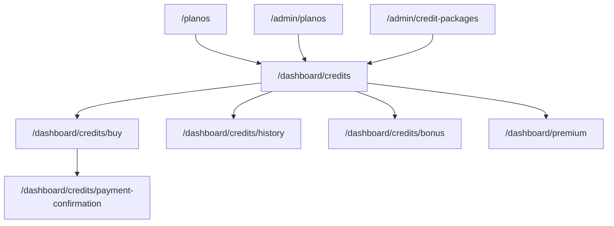

# Módulo de Créditos – WhosDo.com

## Visão Geral
Este módulo gerencia toda a experiência de monetização baseada em créditos, incluindo compra, uso, histórico, bônus e administração de planos/pacotes.

---

## Estrutura de Pastas

```
apps/web/src/app/
  ├── planos/                         # Página de comparação e contratação de planos
  └── (app)/
      ├── dashboard/
      │   └── credits/
      │       ├── page.tsx            # Painel principal de créditos
      │       ├── buy/page.tsx        # Compra de créditos
      │       ├── payment-confirmation/page.tsx # Confirmação de pagamento
      │       ├── history/page.tsx    # Histórico de créditos
      │       └── bonus/page.tsx      # Bônus e gamificação
      ├── premium/page.tsx            # Recursos premium
      └── admin/
          ├── planos/page.tsx         # Administração de planos
          └── credit-packages/page.tsx# Administração de pacotes de créditos

apps/web/src/features/credits/
  ├── CreditDashboardCard.tsx
  ├── CreditHistoryTable.tsx
  ├── CreditPackageCard.tsx
  ├── BuyCreditsModal.tsx
  ├── PaymentStatus.tsx
  ├── DailyBonusButton.tsx
  ├── PremiumActionButton.tsx
  ├── InsufficientCreditsDialog.tsx
  └── ...

apps/web/src/services/
  └── credits.service.ts
```

---

## Rotas e Páginas

- `/planos` – Comparação e contratação de planos
- `/dashboard/credits` – Painel central de créditos
- `/dashboard/credits/buy` – Compra de pacotes de créditos
- `/dashboard/credits/payment-confirmation` – Confirmação visual do pagamento
- `/dashboard/credits/history` – Histórico detalhado de créditos
- `/dashboard/credits/bonus` – Bônus, gamificação e indicações
- `/dashboard/premium` – Recursos premium e uso de créditos
- `/admin/planos` – Administração de planos (opcional)
- `/admin/credit-packages` – Administração de pacotes de créditos (opcional)

---

## Componentes Principais
- **CreditDashboardCard**: Mostra saldo, botão de compra e atalhos.
- **CreditHistoryTable**: Lista transações de créditos.
- **CreditPackageCard**: Exibe pacotes disponíveis para compra.
- **BuyCreditsModal**: Modal para seleção e compra de créditos.
- **PaymentStatus**: Feedback visual do status do pagamento.
- **DailyBonusButton**: Botão para reivindicar bônus diário.
- **PremiumActionButton**: Usa créditos para desbloquear recursos premium.
- **InsufficientCreditsDialog**: Dialog de saldo insuficiente.

---

## Fluxo de Navegação



---

## Dicas para Onboarding da Equipe
- Consulte o arquivo `docs/pagamentos-e-creditos/paginas-ux-creditos.md` para detalhes de UX e requisitos de cada página.
- Use o serviço `credits.service.ts` para toda lógica de saldo, compra e histórico.
- Implemente e teste os componentes de UI de forma isolada antes de integrar nas páginas.
- Priorize `/planos`, `/dashboard/credits`, `/dashboard/credits/buy` e `/dashboard/premium` para MVP.
- Integração de pagamento pode começar com mock e evoluir para Stripe/Pix.
- Use o fluxograma acima para entender o fluxo do usuário e dependências entre páginas.

---

## Contato
Dúvidas ou sugestões? Fale com o time de produto ou consulte a documentação técnica no diretório `docs/pagamentos-e-creditos/`. 