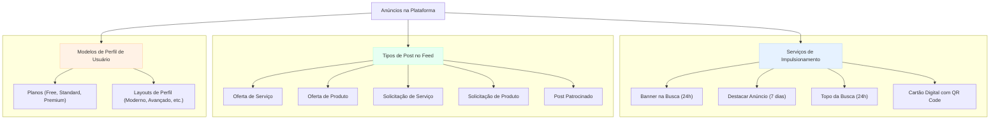

# Tipos e Modelos de Anúncios na Plataforma

Este documento detalha os diferentes tipos de anúncios e itens promocionais disponíveis na plataforma, categorizados para fácil entendimento.

Atualmente, a plataforma trabalha com três categorias principais:

1.  **Serviços de Impulsionamento:** Opções que um usuário pode comprar com créditos para aumentar sua visibilidade.
2.  **Tipos de Post no Feed:** Formatos de conteúdo que os usuários podem criar e que aparecem no feed principal.
3.  **Modelos de Perfil:** O próprio perfil do usuário, cujo modelo de exibição varia conforme o plano e a configuração.

---

### Diagrama Geral

---

## Modelos de Anúncios e Onde Aparecem

Aqui está uma lista dos principais modelos de anúncios e onde eles são exibidos na plataforma.

### 1. Banner Lateral Patrocinado (Card na Coluna Direita)
-   **O que é:** Um card de anúncio visual.
-   **Onde aparece:** Na coluna da direita, visível em várias partes da plataforma, como no Feed de atividades.
-   **Conteúdo:** Geralmente contém uma imagem, o nome da marca/perfil e um link para o perfil ou site externo.
-   **Como Ativar:** Vinculado à opção **Destacar Anúncio (7 dias)**, que promove o usuário em múltiplos locais.

### 2. Banner no Topo da Página de Busca
-   **O que é:** Um carrossel de banners com imagens de alta qualidade e largura total.
-   **Onde aparece:** No topo da página de resultados de busca, garantindo máxima visibilidade.
-   **Conteúdo:** Imagem, título chamativo e um link direto.
-   **Como Ativar:** Através da compra do serviço **Banner na Busca (24h)** na página de promoções.

### 3. Resultado de Busca Promovido
-   **O que é:** O perfil do usuário posicionado no topo da lista de resultados.
-   **Onde aparece:** Acima de todos os outros resultados orgânicos na página de busca.
-   **Conteúdo:** O card do perfil do usuário com um selo de "Promovido" para indicar o destaque.
-   **Como Ativar:** Comprando o serviço **Topo da Busca (24h)**.

### 4. Post Patrocinado no Feed
-   **O que é:** Um post comum do feed (oferta de serviço, produto, etc.) que recebe maior alcance e um destaque visual.
-   **Onde aparece:** Diretamente no feed de atividades dos outros usuários, com maior frequência de exibição.
-   **Conteúdo:** O post original com um selo de "Patrocinado".
-   **Como Ativar:** Relacionado à opção **Destacar Anúncio (7 dias)**.

### 5. Perfil Premium como Anúncio
-   **O que é:** O próprio perfil do usuário, que se torna uma página de vendas completa com recursos avançados.
-   **Onde aparece:** Na URL pública e exclusiva do perfil do usuário.
-   **Conteúdo:** Layouts exclusivos (`StandardProfileLayout`, `PremiumProLayout`), banners internos personalizados, vídeos do YouTube, seção de depoimentos de clientes e mais.
-   **Como Ativar:** Realizando o upgrade para um plano **Premium**.

### 2. Tipos de Post no Feed

O feed da plataforma suporta diferentes tipos de publicações, que funcionam como anúncios ou classificados:

-   **Oferta de Serviço:** Um usuário oferece um serviço específico (ex: "Corte de cabelo em domicílio").
-   **Oferta de Produto:** Um usuário vende um produto (ex: "Bolo no pote para delivery").
-   **Solicitação de Serviço:** Um usuário procura por um profissional para um serviço (ex: "Preciso de um eletricista urgente").
-   **Solicitação de Produto:** Um usuário busca comprar um produto (ex: "Procuro notebook usado").
-   **Post Patrocinado:** Um anúncio com maior alcance e destaque visual, geralmente usado para promover cursos, negócios ou eventos.

### 3. Modelos de Exibição de Perfil

O perfil do usuário é a principal forma de anúncio. A sua aparência e os recursos disponíveis dependem do plano contratado:

-   **Planos:**
    -   **Free:** Funcionalidades básicas, layout simples.
    -   **Standard:** Acesso a mais seções no perfil e a modelos de layout mais modernos.
    -   **Premium:** Acesso a todos os recursos, como banners personalizados no perfil, vídeos, depoimentos e layouts avançados.

-   **Layouts de Perfil:** Existem diferentes templates visuais que mudam a forma como as informações do usuário são apresentadas, como:
    -   `FreeProfileLayout`
    -   `MinimalistCardLayout`
    -   `ModernProfileLayout`
    -   `PortfolioFocusLayout`
    -   `StandardProfileLayout`
    -   `PremiumProLayout`

---

## Novos Tipos de Anúncios Inspirados em Redes Sociais

### Story Patrocinado
- **O que é:** Anúncio em formato de story (imagem ou vídeo curto).
- **Onde aparece:** No topo do feed, em carrossel de stories.
- **Como Ativar:** Serviço de impulsionamento específico ou pacote premium.

### Carrossel de Anúncios
- **O que é:** Vários anúncios em sequência, deslizando horizontalmente.
- **Onde aparece:** No feed ou em banners de destaque.
- **Como Ativar:** Serviço de impulsionamento ou destaque especial.

### Anúncio em Vídeo
- **O que é:** Anúncio em vídeo curto, com autoplay e destaque visual.
- **Onde aparece:** No feed, banners ou página inicial.
- **Como Ativar:** Serviço de vídeo patrocinado.

### Notificação Patrocinada
- **O que é:** Notificação enviada ao usuário, destacando promoções ou perfis.
- **Onde aparece:** Lista de notificações do usuário.
- **Como Ativar:** Serviço de notificação patrocinada. 