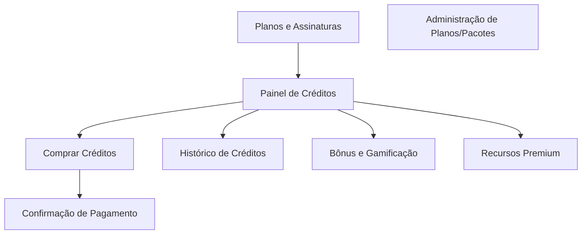
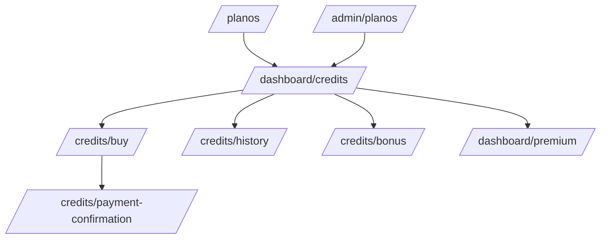

# Páginas Essenciais – Monetização, Créditos e Planos (WhosDo.com)

Este documento lista e detalha todas as páginas recomendadas para cobrir a experiência completa de monetização, planos, créditos e pagamentos na plataforma WhosDo.com, integrando as melhores práticas de UX, frontend e infraestrutura.

---

## 1. Página de Planos e Assinaturas
- **Rota:** `/planos` ou `/dashboard/planos`
- **Função:** Apresenta comparação entre Free, Standard e Premium, benefícios, preços, botão de contratação/upgrade.
- **Elementos:**
  - Tabela comparativa de planos
  - Cards de cada plano com destaque para o recomendado
  - Botão "Assinar" ou "Fazer upgrade"
  - FAQ sobre planos e pagamentos

---

## 2. Painel de Créditos
- **Rota:** `/dashboard/credits` ou `/credits`
- **Função:** Centraliza tudo sobre créditos do usuário.
- **Elementos:**
  - Saldo atual de créditos
  - Botão "Comprar Créditos"
  - Lista de pacotes disponíveis
  - Histórico de uso (tabela)
  - Bônus/recompensas diárias
  - Atalhos para recursos premium

---

## 3. Página/Modal de Compra de Créditos
- **Rota:** `/credits/buy` ou modal em `/dashboard/credits`
- **Função:** Fluxo de seleção de pacote, pagamento e confirmação.
- **Elementos:**
  - Cards de pacotes de créditos
  - Seleção de método de pagamento (Stripe, Pix, MercadoPago)
  - Resumo do pedido
  - Feedback de status (carregando, sucesso, erro)

---

## 4. Página de Confirmação de Pagamento
- **Rota:** `/credits/payment-confirmation`
- **Função:** Exibe status do pagamento, libera créditos e orienta próximo passo.
- **Elementos:**
  - Status (aprovado, pendente, erro)
  - Resumo da compra
  - Botão para voltar ao painel de créditos

---

## 5. Página de Histórico de Créditos
- **Rota:** `/credits/history` (ou seção/tab no painel)
- **Função:** Exibe todas as transações de créditos do usuário.
- **Elementos:**
  - Tabela de transações (tipo, valor, descrição, data)
  - Filtros por tipo/data
  - Paginação ou scroll infinito

---

## 6. Página de Recursos Premium
- **Rota:** `/dashboard/premium` ou `/premium`
- **Função:** Lista recursos desbloqueáveis com créditos ou assinatura.
- **Elementos:**
  - Cards de recursos premium (ex: destaque, QR Code, mídia extra)
  - Botão "Usar créditos" ou "Assinar Premium"
  - Feedback de saldo insuficiente

---

## 7. Página de Bônus e Gamificação
- **Rota:** `/dashboard/credits/bonus` ou `/credits/bonus`
- **Função:** Central de recompensas, bônus diários, indicação, missões.
- **Elementos:**
  - Botão "Reivindicar bônus diário"
  - Progresso de missões/indicações
  - Histórico de bônus recebidos

---

## 8. Página de Administração de Planos/Pacotes (opcional, para admin)
- **Rota:** `/admin/planos` ou `/admin/credit-packages`
- **Função:** Gerenciar planos, pacotes de créditos, promoções.
- **Elementos:**
  - CRUD de planos e pacotes
  - Relatórios de vendas e uso

---

## 🧩 Elementos/Componentes Reutilizáveis
- Tabela comparativa de planos
- Card de plano
- Card de pacote de créditos
- Tabela de histórico de créditos
- Botão de compra/upgrade
- Modal de confirmação de pagamento
- Botão de bônus diário
- Dialog de saldo insuficiente

---

## 🌐 Resumo Visual do Fluxo

---

## Observações
- Todas as páginas devem seguir o padrão visual e UX descrito em `frontend-ux-visual-analysis.md`.
- Integração com Supabase e métodos de pagamento conforme `infrastructure-and-operations-guide.md`.
- Os componentes devem ser modulares e reutilizáveis entre páginas.

---

## Planejamento Detalhado de Implementação das Páginas de Monetização e Créditos (2024)

### Ordem Ideal de Criação das Páginas

1. `/planos` – Página de comparação e contratação de planos (alta prioridade)
2. `/dashboard/credits` – Painel central de créditos (altíssima prioridade)
3. `/credits/buy` – Fluxo de compra de pacotes de créditos
4. `/credits/payment-confirmation` – Confirmação visual do pagamento
5. `/dashboard/premium` – Recursos premium e uso de créditos
6. `/credits/history` – Histórico detalhado de créditos
7. `/credits/bonus` – Bônus, gamificação e indicações
8. `/admin/planos` – Administração de planos e pacotes (opcional)

#### Componentes principais sugeridos para cada página:
- PlansComparisonTable, PlanCard, UpgradeButton, FAQPlans
- CreditDashboardCard, CreditHistoryTable, CreditPackageCard, BuyCreditsModal, DailyBonusButton, PremiumShortcuts
- PaymentOptions, PaymentStatus, ClaimBonusButton, ReferralCodeBox, BonusProgress, PremiumFeatureCard, PremiumActionButton, InsufficientCreditsDialog, PlanEditor, PackageEditor, SalesReportTable

#### Fluxo visual sugerido:

#### Recomendações para MVP:
- Priorizar `/planos`, `/dashboard/credits`, `/credits/buy`, integração de pagamento básica e `/dashboard/premium`.
- Depois, implementar histórico, bônus e admin.

> Este planejamento foi gerado a partir da análise dos documentos internos e melhores práticas de UX/negócio para monetização SaaS.

---

> Documento integrado com: creditos-planejamento.md, plano-execucao-creditos.md, plano-fases-creditos.md, planos-contratacao-creditos.md, monetization-strategy.md, frontend-ux-visual-analysis.md, infrastructure-and-operations-guide.md.

---

## Esquema de Templates de Layout de Perfil Público (2024)

### Tabela de Templates, Planos e Componentes

| Template ID         | Nome                | Plano(s)         | Componente React           |
|---------------------|---------------------|------------------|----------------------------|
| minimalist-card     | Cartão Minimalista  | Free             | MinimalistCardLayout       |
| (sem id, fallback)  | Básico              | Free             | BasicProfileLayout         |
| default             | Perfil Padrão       | Standard,Premium | FreeProfileLayout        |
| portfolio-focus     | Portfolio Focus     | Standard         | PortfolioFocusLayout       |
| commercial-web      | Site Comercial      | Premium          | (a definir)                |
| premium-pro         | Premium Pro         | Premium          | PremiumProLayout           |
| (sem id, fallback)  | Avançado            | Premium          | StandardProfileLayout      |

### Observações
- **Free:** Só pode usar Cartão Minimalista (perfil completo) ou Básico (perfil incompleto).
- **Standard:** Pode usar Perfil Padrão (default) ou Portfolio Focus.
- **Premium:** Pode usar Perfil Padrão, Site Comercial, Premium Pro ou Avançado.
- O campo `availableFor` nos templates controla a seleção na interface.
- O componente renderizado depende do plano e do template escolhido pelo usuário.

> Última revisão: 2024. Para sugestões de novos templates ou ajustes, consulte o time de produto/UX.

---

## [ATUALIZAÇÃO 2024-06] – Progresso da Integração Mercado Pago

### O que já foi implementado:
- Página `/dashboard/credits/buy` exibe pacotes de créditos com o componente `CreditPackagesGrid`.
- Ao clicar em "Comprar", o frontend chama a API `/api/payments/mercadopago/checkout` (a ser implementada) e redireciona o usuário para o checkout do Mercado Pago.
- Página `/dashboard/credits/payment-confirmation` lê os parâmetros de retorno do Mercado Pago, chama a API `/api/payments/mercadopago/validate` (a ser implementada) e exibe o status do pagamento ao usuário (aprovado, pendente, rejeitado, erro).

### Próximos passos para continuar a integração:
1. **Backend/API:**
   - Implementar a rota `/api/payments/mercadopago/checkout` para criar a preferência de pagamento no Mercado Pago e retornar a URL de checkout.
   - Implementar a rota `/api/payments/mercadopago/validate` para validar o pagamento, registrar a transação e creditar os créditos ao usuário.
2. **Serviço de Créditos:**
   - Criar ou expandir `credits.service.ts` para registrar transações, atualizar saldo e consultar histórico.
3. **Banco de Dados:**
   - Criar migration para tabela `credit_transactions` (ou similar) para registrar cada compra, status, valor, usuário, etc.

> Após a implementação das APIs e serviço, o fluxo de compra estará completo e pronto para testes integrados.

> [2024-06] Correção aplicada: a página `/dashboard/credits/buy` agora está marcada com `"use client"`, permitindo uso de hooks React (useEffect, useState) conforme exigido pelo Next.js. O fluxo de compra de créditos está funcional no frontend. 